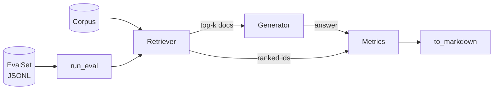

# rag-eval-harness

A tiny, **zero-dependency** harness for evaluating RAG pipelines. Score retrieval quality, answer faithfulness, and latency over your own eval sets — no API keys required to run the baselines.

## Why

Most RAG demos stop at "it answered". Production RAG needs numbers: did the retriever find the right chunks, is the answer actually supported by them, and how slow is the pipeline. This harness gives you that loop in ~200 lines of readable Python, with clean seams to plug in your own retriever, generator, or judge.

## Quickstart

```bash
pip install .
python examples/run_example.py
```

Or in your own code:

```python
from rag_eval import (
    Document, EvalSet, TfIdfRetriever, EchoGenerator, run_eval, to_markdown,
)

corpus = [Document(id="d1", text="..."), ...]
eval_set = EvalSet.from_jsonl("my_eval_set.jsonl")

report = run_eval(eval_set, TfIdfRetriever(corpus), EchoGenerator(), k=5)
print(to_markdown(report))
```

Sample output:

```
# RAG eval report
Items: 5 · k=3
## Aggregate
| metric | value |
| recall@3 | 1.0000 |
| mrr | 1.0000 |
| ndcg@3 | 0.9839 |
| faithfulness | 1.0000 |
| p50_s | 0.0001 |
...
```

## How it works



1. **Retrieve** — each query goes through your `Retriever` (`retrieve(query, k)`).
2. **Generate** — the top-k chunks go to your `Generator` (`generate(query, docs)`).
3. **Measure** — per item: `recall@k`, reciprocal rank, `nDCG@k` against your judged `relevant_doc_ids`; faithfulness of the answer against the retrieved chunks; wall-clock latency.
4. **Report** — aggregate means + p50/p95 latency, and a per-item table, rendered as Markdown.

## Metrics

| Metric | What it answers |
| --- | --- |
| `recall@k` | Of the docs you judged relevant, how many showed up in the top-k? |
| `mrr` | How high is the first relevant doc ranked? |
| `ndcg@k` | Ranking quality with position discounting. |
| `faithfulness` | What fraction of the answer's sentences are supported by the retrieved chunks? (token-overlap F1 heuristic — fast and deterministic; see note below) |
| `p50_s` / `p95_s` / `mean_s` | Per-item pipeline latency. |

**Honesty note on faithfulness:** the built-in scorer is a heuristic, not a judge. It catches sentence-level grounding failures (off-topic or invented sentences) but will not catch single-word substitutions like "Paris" → "Mars" — there's a test documenting exactly that boundary. For production evals, bring an LLM judge; the roadmap includes an adapter for one.

## Plug in your own components

```python
from rag_eval import RetrievedDoc

class MyDenseRetriever:
    def retrieve(self, query: str, k: int = 5) -> list[RetrievedDoc]:
        ...  # your embedding search here

class MyLLMGenerator:
    def generate(self, query: str, docs: list[RetrievedDoc]) -> str:
        ...  # your LLM call here; cite docs, say "I don't know" when unsure

report = run_eval(eval_set, MyDenseRetriever(), MyLLMGenerator(), k=5)
```

Any object with the right method signature works — the `Retriever`/`Generator` protocols are structural, no inheritance needed.

Eval sets are JSONL, one object per line:

```json
{"id": "q1", "query": "How does RAG reduce hallucinations?",
 "relevant_doc_ids": ["doc-1", "doc-8"],
 "reference_answer": "By grounding answers in retrieved documents."}
```

## Development

```bash
pip install ".[dev]"
pytest -q
```

CI runs pytest on Python 3.10–3.12.

## Roadmap

- LLM-judge adapter (claim extraction + entailment scoring) behind an optional extra
- nDCG with graded relevance
- Reranker interface + example
- Parquet/CSV dataset loaders

## License

MIT — see [LICENSE](LICENSE).
